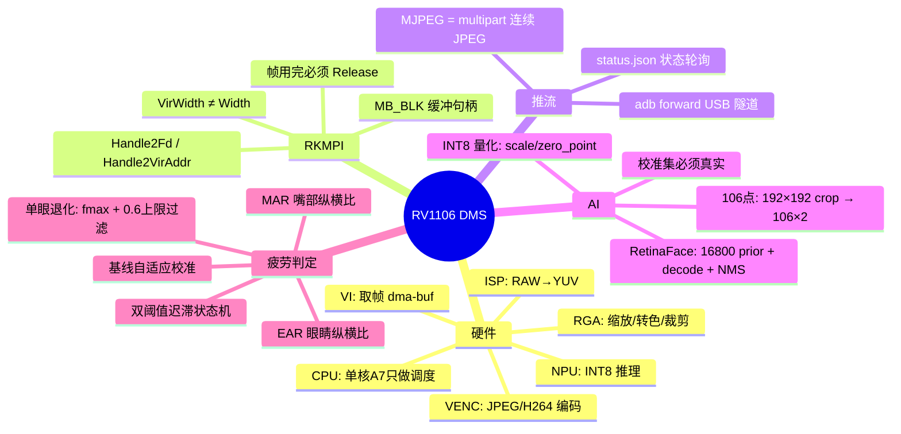

# RV1106 开发板与 DMS 疲劳检测原理教程

> 以 `hand_capture_right` 工程为实战案例
> 读者对象：想搞懂「摄像头 → 芯片 → AI 推理 → 推流」整条链路的嵌入式开发者
> 版本：2026-08-23（对应工程 V2-A 硬件管线验收版）

---

## 目录

- 第 1 章 这块板子是什么：RV1106 全景
- 第 2 章 RKMPI：芯片的「数据总线」
- 第 3 章 视频流是怎么推到你电脑上的
- 第 4 章 NPU 推理：从 ONNX 到 rknn_run
- 第 5 章 人脸检测原理：RetinaFace 拆解
- 第 6 章 106 点关键点与疲劳判定
- 第 7 章 性能工程实战：把 CPU 从 76% 打到 19%
- 第 8 章 思维导图汇总
- 第 9 章 例题与答案
- 第 10 章 动手实验清单

---

## 第 1 章 这块板子是什么：RV1106 全景

### 1.1 一句话定位

RV1106 不是「一块能跑 Linux 的小板子」，它是一颗 **IPC（网络摄像机）视觉专用 SoC**。它的整个设计哲学可以浓缩成一句话：

> **像素数据在硬件单元之间流动，CPU 只做调度，永远不碰像素。**

理解这句话，就理解了这块芯片的一半。我们工程里那个著名的性能问题（CPU 占用 92%），根源恰恰是违背了这条设计意图——把硬件该干的活（JPEG 解码、缩放）全揽到了那颗单核 CPU 身上。第 7 章会完整复盘这个案例。

### 1.2 芯片里有什么

RV1106 的主要硬件单元，以及它们在本工程中的角色：

| 硬件单元 | 能力 | 本工程中的用途 |
|----------|------|----------------|
| CPU | 单核 Cortex-A7（实测 `/proc/cpuinfo` 只有 1 个 processor） | 线程调度、状态机、网络服务、NMS 后处理 |
| 内存 | 约 185MB（实测 `free` total = 185288 kB） | 程序 + 帧缓冲 + 模型 |
| ISP | 最高 5MP@30，支持 HDR/WDR/3DNR 降噪 | 把 MIS5001 传感器的 RAW 数据处理成可用的 YUV 图像 |
| NPU | INT8/INT16 推理加速（G2 版 0.5 TOPS，G3 版 1.0 TOPS） | RetinaFace 人脸检测（30ms/帧）+ 106 点关键点（4.4ms/帧） |
| VENC | H.265/H.264 硬件编码、JPEG 硬件编码 | 把 VI 帧编码成 JPEG 用于推流 |
| RGA | 2D 图形引擎：缩放、裁剪、色彩空间转换 | AI 输入预处理（1.6ms 完成原来 CPU 116ms 的缩放） |
| VI | 视频输入接口（MIPI CSI / DVP） | 从 ISP 拿帧 |
| 其他 | 内置音频编解码器、MCU、看门狗、RTC、TrustZone | 本工程暂未使用（后续可加语音提醒、防篡改等） |

### 1.3 为什么 CPU 这么金贵

单核 A7 是什么概念？做个实测对比（本工程真实测量值）：

| 操作 | 耗时（单核 A7 软件执行） |
|------|--------------------------|
| 软件解码一张 1280×720 JPEG（stb_image） | ~115 ms |
| 软件缩放 1280×720 → 640×640（双线性） | ~116 ms |
| RGA 硬件缩放+转色 同一张图 | **~1.6 ms** |
| NPU 跑一次 RetinaFace | ~30 ms |

软件缩放比 NPU 推理还慢 4 倍。在这颗芯片上，**谁用 CPU 搬像素，谁就是在犯罪**。正确的分工是：

```text
硬件干：取图（VI）、缩放裁剪转色（RGA）、编码（VENC）、推理（NPU）
CPU 干：调度、逻辑判断、协议、文本、统计
```

### 1.4 系统形态

- 操作系统：Buildroot 裁剪的 Linux，C 库是 **uClibc**（不是 glibc），所以交叉编译工具链是 `arm-rockchip830-linux-uclibcgnueabihf`
- 板型：LuckFox Pico RV1106，通过 USB 连接电脑，`adb` 做文件传输和 shell
- 摄像头：MIS5001 500 万像素 RGB 传感器，本工程取 1280×720@15FPS
- 存储：SD 卡挂载在 `/mnt/sdcard`，模型和日志都放在 `/mnt/sdcard/dms/`

---

## 第 2 章 RKMPI：芯片的「数据总线」

### 2.1 RKMPI 是什么

RKMPI（Rockchip Media Process Interface）是瑞芯微的媒体处理接口库，风格沿袭海思 MPI。它把芯片里的硬件单元抽象成一个个「模块」，每个模块有「通道」，通道之间可以「绑定（bind）」形成流水线：

```text
┌──────┐   ┌──────┐   ┌───────┐   ┌──────┐
│  VI  │──→│ RGA  │──→│ VENC  │──→│ 网络 │
└──────┘   └──────┘   └───────┘   └──────┘
视频输入    2D处理     硬件编码
```

本工程用到的模块：

| 模块 | 作用 | 工程里的位置 |
|------|------|--------------|
| VI | 从 ISP 取视频帧 | `src/hal/hal_camera_rkmpi.c` |
| VENC | 硬件 JPEG 编码 | 同上，`venc_grab_one_frame()` |
| MB | 媒体缓冲池（物理连续内存管理） | `src/dms/dms_rga_preprocess.c` |
| RGA | 2D 处理（缩放/转色/裁剪） | 同上（独立的 librga） |
| RKNN Runtime | NPU 推理 | `src/dms/dms_retinaface.c` 等 |

### 2.2 帧是什么：VIDEO_FRAME_INFO_S

VI 取到的一帧，是一个结构体（`VIDEO_FRAME_INFO_S`），里面最关键的部分：

```c
vi_frame.stVFrame.u32Width      // 图像可见宽度，如 1280
vi_frame.stVFrame.u32Height     // 图像可见高度，如 720
vi_frame.stVFrame.u32VirWidth   // 内存行宽（stride），可能 ≥ 1280！
vi_frame.stVFrame.u32VirHeight  // 内存实际高度
vi_frame.stVFrame.enPixelFormat // 像素格式，本工程是 RK_FMT_YUV420SP（NV12）
vi_frame.stVFrame.pMbBlk        // 指向媒体缓冲块的句柄
```

**这里藏着新手最容易踩的坑：`u32Width` 和 `u32VirWidth` 不是一回事。** 硬件为了对齐（通常 16 或 64 字节），每行像素后面可能补「 padding」。如果你按 `width` 去索引内存而实际是 `vir_width`，图像就会斜成一道道斜杠——这就是传说中的「花屏」。

### 2.3 内存模型：为什么都要 dma-buf

在 PC 上，`malloc` 一块内存谁都能用。但在 SoC 里，硬件单元（VI/RGA/NPU/VENC）是**直接读写物理内存**的，它们需要：

1. **物理地址连续**（很多硬件不支持分散的页表映射）
2. **能拿到一个可传递的句柄**（Linux 下就是 dma-buf 的 fd）

所以 RKMPI 世界里流通的不是 `void*`，而是 `MB_BLK`（媒体缓冲块句柄），通过它可以换到两种「货币」：

```c
int   fd  = RK_MPI_MB_Handle2Fd(blk);        // dma-buf fd → 给 RGA / NPU 用
void *vir = RK_MPI_MB_Handle2VirAddr(blk);   // 虚拟地址   → 给 CPU memcpy 用
```

本工程 VI 的配置（`hal_camera_rkmpi.c` 的 `vi_chn_init()`）：

```c
vi_chn_attr.enMemoryType  = VI_V4L2_MEMORY_TYPE_DMABUF;  // 关键：dma-buf 内存
vi_chn_attr.enPixelFormat = RK_FMT_YUV420SP;             // NV12
vi_chn_attr.enCompressMode = COMPRESS_MODE_NONE;         // 不压缩，RGA 可直接处理
vi_chn_attr.u32Depth      = 2;                           // 帧队列深度
```

### 2.4 NV12 是什么

NV12 是一种 YUV 半平面格式：

```text
内存布局：先存全部 Y（亮度），再存交错排列的 U/V（色度）
Y 平面：1280 × 720 字节
UV 平面：1280 × 360 字节（每 2×2 像素共享一组 U、V）
```

摄像头/ISP 天然输出 YUV（人眼对亮度敏感、对色度不敏感，YUV 可以压缩色度带宽）。而 AI 模型通常要吃 RGB/BGR 三通道图。**NV12 → RGB 的转换**就是 RGA 的本职工作之一。

一个额外的坑：YUV 有两种量程——**limited range**（Y∈[16,235]，广播电视标准）和 **full range**（Y∈[0,255]，JPEG/JFIF 标准）。RGA 默认按 BT601 limited 转换，而 JPEG 解码器输出的是 full range。两者混用会让图像偏灰偏淡，AI 模型输入分布偏移、精度下降。本工程的处理是直接告诉 RGA 用 full range：

```c
src_img.color_space_mode = IM_YUV_BT601_FULL_RANGE;
```

---

## 第 3 章 视频流是怎么推到你电脑上的

### 3.1 全链路总览

你在 ffplay 里看到的画面，走的是这条路：

```text
MIS5001 传感器
    ↓ (MIPI CSI)
ISP（AIQ 算法：自动曝光/白平衡/降噪）
    ↓
VI 通道 0：NV12 dma-buf 帧，1280×720@15FPS
    ↓ RK_MPI_VI_GetChnFrame
VENC 通道：硬件 JPEG 编码
    ↓ RK_MPI_VENC_GetStream
应用层：malloc + memcpy 出 JPEG 字节流
    ↓ HTTP（MJPEG over HTTP，端口 8090）
adb forward（USB 隧道 tcp:8090 → tcp:8090）
    ↓
电脑：ffplay / 浏览器
```

### 3.2 取帧与编码：工程实况

本工程的取帧函数 `venc_grab_one_frame()`（`hal_camera_rkmpi.c`）每被调用一次做这些事：

```c
RK_MPI_VI_GetChnFrame(0, 0, &vi_frame, timeout);   // 1. 从 VI 拿一帧 NV12
RK_MPI_VENC_StartRecvFrame(venc_chn, &recv_param); // 2. 告诉 VENC 准备收图
RK_MPI_VENC_SendFrame(venc_chn, &vi_frame, 0);     // 3. 把这帧送进编码器
RK_MPI_VENC_GetStream(venc_chn, &stream, timeout); // 4. 取编码好的 JPEG
// 5. memcpy 出 JPEG 数据给上层
RK_MPI_VENC_ReleaseStream(...);                    // 6. 释放码流
RK_MPI_VI_ReleaseChnFrame(...);                    // 7. 归还 VI 帧（关键！）
```

注意第 7 步：**VI 帧是借来的，用完必须还**。不还的话 VI 队列会耗尽，采集直接卡死。V2-A 改造时我们把 RGA 预处理插在第 3 步和第 7 步之间——在还帧之前，让 RGA 也把这张 NV12 用一次，一鱼两吃。

### 3.3 MJPEG over HTTP：最朴素的视频流协议

MJPEG 推流的原理简单到令人发指：**就是一个永远下载不完的 HTTP 响应，里面一帧接一帧地塞 JPEG 图片**。

响应头长这样：

```http
HTTP/1.1 200 OK
Content-Type: multipart/x-mixed-replace; boundary=frame
```

然后服务器不停地写：

```http
--frame
Content-Type: image/jpeg
Content-Length: 91234

<91234 字节的 JPEG 数据>
--frame
Content-Type: image/jpeg
Content-Length: 91087

<下一帧 JPEG 数据>
--frame
...
```

客户端（ffplay/浏览器）收到一个 boundary 块就解码显示一张图。所谓「视频」，不过是每秒 15 张连续播放的 JPEG 照片。这就是为什么它叫 Motion-JPEG。

你可以用 30 行 Python 手写一个客户端验证这个原理（见第 9 章例题 4）。

### 3.4 两条流的区别

本工程实际上有两条流：

| 流 | 路径 | 用途 |
|----|------|------|
| `/stream.mjpg` | 原始 JPEG 直接转发 | 看「干净」画面，零 AI 开销 |
| `/stream_debug.mjpg` | AI 线程：JPEG → CPU 解码 → 画绿框/106 点/HUD → CPU 重新编码 JPEG | 看「带标注」画面 |

第二条流是当前已知的性能刺客：软件解码 131ms + 软件编码 204ms = 每帧 336ms，打开调试流时 AI 帧率会从 15FPS 掉到 2.5FPS。这就是 V2-C 计划要用硬件 OSD（VENC 的 RGN 功能直接把框烧进码流）解决的事。

### 3.5 adb forward：USB 里的隧道

板子没有连 WiFi 时，电脑怎么访问它的 8090 端口？靠 adb 的端口转发：

```bash
adb forward tcp:8090 tcp:8090
```

它在本机 127.0.0.1:8090 监听，把 TCP 连接通过 USB 上的 adb 协议隧道透传到板子的 8090。对 ffplay 来说，就像在访问本机服务一样。

---

## 第 4 章 NPU 推理：从 ONNX 到 rknn_run

### 4.1 模型的一生

一个神经网络模型要在 RV1106 的 NPU 上跑，要经历：

```text
训练好的 ONNX 模型（PC 上）
    ↓ 固定输入形状（本工程：1×3×192×192）
rknn-toolkit2 转换 + INT8 量化（PC 上）
    ↓
.rknn 文件（约 1.4MB，拷到板子 SD 卡）
    ↓ rknn_init 加载
NPU 上推理（板端）
```

转换脚本在本工程 `tools/convert_landmark_rknn.py`，核心几步：

```python
rknn.config(mean_values=[[0,0,0]], std_values=[[1,1,1]],
            target_platform='rv1106')
rknn.load_onnx(model='2d106det_1x3x192x192.onnx')
rknn.build(do_quantization=True, dataset='./calib.txt')  # 量化校准
rknn.export_rknn('2d106det.rknn')
```

### 4.2 INT8 量化：用精度换速度的数学

NPU 快，是因为它用 8 位整数代替 32 位浮点做乘加。但神经网络的权重和激活值是浮点数，怎么办？做一个**仿射映射**：

```text
real_value = scale × (int8_value - zero_point)
```

每一层有自己的 scale。这个 scale 怎么定？需要用一批**校准数据**（几十到几百张真实输入图）跑一遍，统计每层激活值的分布范围。这就是为什么：

> **校准集必须真实。** 本工程 106 点模型的第一版校准集是随机图片——模拟器校验误差 <1px 不代表真实人脸准。正式部署前应该用真实人脸 crop（100~200 张 192×192）重新校准。这是交付文档里留的待办。

### 4.3 板端推理 API 五部曲

以 RetinaFace 为例（`dms_retinaface.c`），板端推理的标准流程：

```c
// 1. 加载模型
rknn_init(&ctx, model_data, model_size, 0, NULL);

// 2. 查询模型输入输出属性（形状/类型/量化参数）
rknn_query(ctx, RKNN_QUERY_NATIVE_INPUT_ATTR, &input_attr, ...);

// 3. 分配输入输出内存（关键：这些内存带 dma-buf fd！）
g_rf.input_mem = rknn_create_mem(ctx, input_size);
rknn_set_io_mem(ctx, g_rf.input_mem, &input_attr);

// 4. 每帧：把图像数据写进 input_mem，然后跑
memcpy(g_rf.input_mem->virt_addr, bgr_data, size);
rknn_run(ctx, NULL);

// 5. 从 output_mem 读结果，反量化成浮点
float score = dequant(out_mem, i);   // (q - zp) * scale
```

`rknn_tensor_mem` 这个结构体值得记住：

```c
typedef struct {
    void    *virt_addr;   // CPU 能访问的虚拟地址
    uint64_t phys_addr;   // 物理地址
    int32_t  fd;          // dma-buf fd —— 零拷贝的钥匙！
    uint32_t size;
    ...
} rknn_tensor_mem_t;
```

因为有了 `fd`，RGA 可以把缩放好的图**直接写进 NPU 的输入内存**，中间不需要任何 memcpy。这就是 V2-B 计划做的事。

### 4.4 一个隐藏 bug 的案例

`rknn_create_mem` 分配的内存带 `ALLOC_INSIDE` 标志，意味着 `rknn_destroy_mem()` 时会**连结构体一起 free 掉**。本工程 deinit 里曾经写了：

```c
rknn_destroy_mem(ctx, mem);
free(mem);        // ← double-free！mem 已经被上一行释放了
```

平时 deinit 很少走到，这个雷一直埋着，是这次 RGA 改造审查代码时顺手挖出来修掉的。教训：**用别人的内存管理 API 时，先搞清楚所有权归谁**。

---

## 第 5 章 人脸检测原理：RetinaFace 拆解

### 5.1 检测问题的本质

分类网络回答「这张图里有没有人」，检测网络要回答「人在哪、多大、置信度多少」。RetinaFace 还额外回答「双眼/鼻尖/嘴角五个点在哪」。

本工程的模型：输入 640×640 BGR，输出三个尺度共 **16800 个候选框**的信息。

### 5.2 Anchor / Prior：检测的脚手架

神经网络不直接「寻找」人脸。它的做法是在图上预设一张密集的「参考框网格」：

```text
特征图 80×80（stride 8） → 每格 2 个 anchor → 12800 个
特征图 40×40（stride 16）→ 每格 2 个 anchor → 3200 个
特征图 20×20（stride 32）→ 每格 2 个 anchor → 800 个
合计：16800 个 prior（先验框）
```

每个 prior 负责预测：「我附近有没有人？如果有，框应该往哪调、调多少？」网络输出的是**相对 prior 的偏移量**，不是绝对坐标：

```text
bbox 输出 4 个数：(dx, dy, dw, dh)
decode 公式：
  cx = prior_cx + dx × prior_w × 0.1   （中心偏移，prior 宽度做单位）
  cy = prior_cy + dy × prior_h × 0.1
  w  = prior_w × exp(dw × 0.2)          （宽高缩放，指数保证为正）
  h  = prior_h × exp(dh × 0.2)
```

5 个关键点的 decode 同理，10 个数（5 点 × x,y），都是相对 prior 的偏移。

置信度输出 2 个数（无人脸/有人脸的 logits），工程里直接取人脸分支做比较，超过阈值（如 0.5）的候选留下。

### 5.3 NMS：去掉重复框

一张脸附近往往有好几个 prior 都「命中」了，会输出一堆重叠框。NMS（非极大值抑制）负责去重：

```text
1. 所有候选按置信度从高到低排序
2. 取出最高分框 A，收入结果
3. 删掉所有与 A 的 IoU（交并比）> 0.4 的框（它们和 A 说的是同一张脸）
4. 重复 2-3，直到候选清空
```

本工程只要最大的一张脸，所以 decode 后按分数排序取第一个即可（`dms_retinaface.c` 里用了 quicksort + NMS）。

### 5.4 坐标反算：模型坐标 → 原图坐标

模型看到的是 640×640，原图是 1280×720。本工程用的是 **stretch（直接拉伸，不等比）**，所以反算很简单：

```c
orig_x = model_x * 1280 / 640;   // ×2
orig_y = model_y * 720 / 640;    // ×1.125
```

注意 x 和 y 的缩放系数**不一样**（因为拉伸改变了宽高比）。如果哪天改成 letterbox（等比缩放+补边），这里就要多减一个 padding 偏移——两种方式的反算公式不同，混用会导致框整体偏移。

### 5.5 输入格式的三个「必须一致」

模型精度出问题，十有八九是输入格式和训练时不一致：

1. **通道顺序**：本模型吃 BGR（参考官方 demo 是 OpenCV 图），喂 RGB 会精度下降
2. **数值范围**：本模型量化输入是 UINT8 NHWC，直接喂 0-255 像素值
3. **缩放方式**：stretch 还是 letterbox，决定坐标反算公式

---

## 第 6 章 106 点关键点与疲劳判定

### 6.1 106 点模型（2d106det）

输入：192×192 RGB 人脸 crop；输出：1×212 向量 = 106 个点 × (x, y)。

后处理公式（2d106det 专用）：

```python
pred = output.reshape(106, 2)
pred += 1.0      # 输出域 [-1, 1] → [0, 2]
pred *= 96.0     # → [0, 192] 像素坐标
```

crop 到原图的映射（crop 左上角 crop_x/crop_y，尺寸 crop_w/crop_h）：

```c
orig_x = crop_x + px * crop_w / 192;
orig_y = crop_y + py * crop_h / 192;
```

crop 框的取法：以 RetinaFace bbox 中心为圆心，边长 = max（脸宽， 脸高） × 1.5 的正方形（多包一些头发/下巴上下文，模型更稳）。

### 6.2 从点到疲劳：三个特征

本工程把 106 个点按语义分组（编号来自对模型的实测标定）：

| 点区间 | 部位 | 用途 |
|--------|------|------|
| 0~32 | 下颌轮廓 | 低头特征（取最低点当下巴） |
| 33~42 / 43~51 | 左眼 / 右眼（各 10 点） | EAR |
| 52~71 | 嘴部（20 点） | MAR |
| 72~86 | 鼻部 | 低头特征（取最低点当鼻底） |

**EAR（眼睛纵横比）**：眼睛睁开时，上下眼睑距离占眼睛宽度的比例大；闭上时趋近 0。

```text
EAR = 眼睑纵向开度 / 眼睛横向宽度
本工程实现：取眼部 10 个点，y 最小的 2 点均值 = 上眼睑，
           y 最大的 2 点均值 = 下眼睑，宽度 = max(x)-min(x)
```

**MAR（嘴部纵横比）**：打哈欠时嘴张得又大又圆，MAR 飙升；正常说话时 MAR 小而快变。

**低头几何代理**：不用真姿态角，用「鼻底在眼睛和下巴之间的相对位置」——低头时鼻尖在画面里向下巴靠近：

```text
head_ratio = (鼻底y - 眼线y) / (下巴y - 眼线y)
低头时这个值增大
```

### 6.3 基线校准与双阈值状态机

每个人的眼睛大小、脸型、坐姿、摄像头角度都不同，绝对阈值不可用。本工程的解法是**开机 2 秒自适应校准**：假设刚开始驾驶员是清醒平视的，统计这段时间的 EAR/MAR 均值作为基线，阈值按基线比例生成：

```c
ear_threshold = ear_baseline × 0.72;   // 闭眼进入线
ear_recover   = ear_baseline × 0.85;   // 睁眼恢复线
mar_threshold = max(0.45, mar_baseline × 1.6);  // 哈欠线
```

为什么要**两条**阈值（迟滞）？防止数值在单条阈值线附近抖动时状态疯狂来回跳：

```text
EAR ↓ 跌破进入线 → 开始计时 → 持续 800ms → EYE_CLOSED
EAR ↑ 升破恢复线 → 立即恢复 NORMAL
进入线 < 恢复线，中间是「迟滞区」，抖不动状态
持续 1500ms → LONG_EYE_CLOSED（疲劳报警）
```

### 6.4 实战踩坑记录（本章最值钱的部分）

今天实测暴露的四个问题，每一个都是教科书级的：

**坑 1：单眼关键点塌缩成 0。** 打哈欠眯眼、侧头、镜片反光时，一只眼的 10 个点会塌成一条线或一个点，EAR 算出精确的 0.000。如果判定逻辑用「双眼平均值」，一只塌 0 的眼会把平均值拉低一半，造成假闭眼。→ **修法：取双眼的 fmax**（真闭眼两只都低才算数）。

**坑 2：单眼关键点冲 1.0。** 同样是退化，另一种模式是点上下散飞，EAR 顶到钳位上限 1.0。这时 fmax 反而被骗（取了那个坏的高值），真闭眼也触发不了。→ **修法：加物理上限 0.6 的合理性过滤**（眼高/眼宽不可能超过 0.6），超限的眼判无效，用另一只眼。

**坑 3：EMA 平滑把信号磨没了。** AI 只有 3.7 FPS 时，1 秒闭眼只有 3~4 个采样点，α=0.45 的指数平滑根本压不下去。→ **修法：判定用原始值，EMA 只用于显示**；V2-A 把 AI 提到 15 FPS 后此问题也自然缓解。

**坑 4：微笑被误判成哈欠。** MAR 是一维特征，露齿笑的纵向开度和哈欠在数值上重叠。→ **方向（待实施）：用内唇开度 + 嘴宽约束**——微笑嘴变宽但内唇缝隙小，哈欠内唇缝隙大但嘴不怎么变宽，两个维度组合就能分开。

---

## 第 7 章 性能工程实战：把 CPU 从 76% 打到 19%

这是今天下午真实发生的改造，完整复盘。

### 7.1 起点：病入膏肓的软件链路

改造前的 AI 输入链路：

```text
VI NV12 帧
  ↓ VENC 硬件编码
JPEG
  ↓ malloc + memcpy（80KB/帧）
AI 线程
  ↓ stb_image 软件解码          115 ms  ← CPU
  ↓ 软件双线性缩放 720p→640²    116 ms  ← CPU
  ↓ RetinaFace NPU               30 ms  ← NPU
  ↓ 106 点 NPU                    7 ms  ← NPU
```

单帧 262ms，AI 只能跑 3.7 FPS，进程 CPU 76.6%，系统 92.4%，每 5 秒丢弃 3100 帧。

### 7.2 测量先行

没有测量就没有优化。本工程有两个测量手段：

1. **分项耗时统计**：每个环节（解码/预处理/推理/后处理）都打点，每 5 秒打印均值（`[DMS PERF]` 日志）
2. **CPU 采样**：两次读 `/proc/stat` 和 `/proc/<pid>/stat`，差值相除得占用率

测量结果一目了然：262ms 里 231ms 是 CPU 在搬像素，**真正 AI 的部分（NPU）只占 37ms**。

### 7.3 改造：V2-A 硬件管线

核心思想：**AI 线程根本不该看到 JPEG**。让 RGA 在 VI 帧归还之前直接把它转成模型输入：

```text
VI NV12 dma-buf
   ├→ VENC → JPEG → MJPEG 推流（完全不动）
   ├→ RGA → 640×640 BGR（RetinaFace 输入，stretch）
   └→ RGA → 1280×720 RGB 全幅（106 点 crop 的源图）
```

关键实现点：

- **MB pool 三缓冲**：目的 buffer 用 `RK_MPI_MB_CreatePool`（CMA 物理连续内存）一次分配 3 块，FREE/READY/IN_USE 三态流转，AI 跟不上就覆盖最旧的——「只要最新帧」的设计哲学贯穿始终
- **RGA 用法**：`importbuffer_fd()` 导入 dma-buf，`imresize_t()` 一次调用同时完成缩放+NV12→BGR 转色
- **色彩空间**：`color_space_mode = IM_YUV_BT601_FULL_RANGE`（与 JPEG 的 full range 对齐）
- **回退开关**：`DMS_HW_PREPROCESS=0` 随时退回软件路径做 A/B 对比

### 7.4 战果

| 指标 | 改造前 | 改造后 | 倍率 |
|------|--------|--------|------|
| 进程 CPU | 76.6% | 19.0% | -75% |
| AI 帧率 | 3.7 FPS | 15 FPS（满帧） | 4× |
| AI 单帧耗时 | 262 ms | 33 ms | 8× |
| AI 丢帧 | ~75% | 0 | — |
| RGA 单次耗时 | — | 1.6 ms | （替代了 116ms 的 CPU 缩放） |

### 7.5 经验法则

1. **先测量，再优化**。猜测的瓶颈多半是错的。
2. **问一句「这事有没有硬件单元干」**。有就给硬件。
3. **保留回退路径**。新链路出了任何问题，一键切回旧链路，对比定位。
4. **一次只改一层**。V2-A 只改 AI 输入链；视频硬件化（H.264/RTSP/OSD）留给 V2-C。两个大改一起做，出问题无法定位。

---

## 第 8 章 思维导图汇总

### 8.1 系统全景图

```text
                        RV1106 DMS 系统
┌──────────────────────────────────────────────────────────┐
│                                                          │
│  MIS5001 ──→ ISP/AIQ ──→ VI (NV12 dma-buf)               │
│                              │                           │
│              ┌───────────────┼───────────────┐           │
│              ↓               ↓               ↓           │
│           VENC            RGA            RGA             │
│           JPEG        640×640 BGR    1280×720 RGB        │
│              │               │               │           │
│              ↓               ↓               ↓           │
│          MJPEG 推流    RetinaFace      人脸 crop         │
│         /stream.mjpg     NPU 30ms      192×192           │
│                              │               │           │
│                              ↓               ↓           │
│                         bbox+5关键点    106点 NPU 4.4ms  │
│                              │               │           │
│                              └───────┬───────┘           │
│                                      ↓                   │
│                          EAR / MAR / 低头比例            │
│                                      ↓                   │
│                        基线校准 + 双阈值状态机           │
│                                      ↓                   │
│         ┌───────────────┬────────────┼──────────────┐    │
│         ↓               ↓            ↓              ↓    │
│     status.json   调试流画框     状态截图       后续：报警│
│                                                          │
└──────────────────────────────────────────────────────────┘
```

### 8.2 知识地图（mermaid）



---

## 第 9 章 例题与答案

### 例题 1（概念）
为什么 RV1106 上软件 JPEG 解码是「犯罪」？用数据说明。

**答案**：单核 A7 软件解码一张 720p JPEG 约 115ms，而 RGA 硬件做缩放+转色只要 1.6ms，NPU 跑整个人脸检测模型也才 30ms。软件解码一张图的时间够 NPU 推理 4 次。在这颗芯片上 CPU 是最稀缺资源，应该只做调度和逻辑，像素搬运必须交给硬件单元。

### 例题 2（内存模型）
VI 帧的 `u32Width=1280`、`u32VirWidth=1280+64`，如果你按 1280 的行宽去遍历像素会发生什么？为什么？

**答案**：图像逐行错位，出现斜条纹花屏。因为硬件按 64 字节对齐在在每行末尾补了 padding，内存里第 n 行实际起始偏移是 `n × VirWidth` 而不是 `n × Width`。用 RGA/MB 处理时必须把 VirWidth 作为 stride 传入。

### 例题 3（协议）
MJPEG 推流和 H.264 推流的本质区别是什么？各有什么优劣？

**答案**：MJPEG 每帧是独立完整 JPEG 图片（帧内压缩），通过 HTTP multipart 连续下发；H.264 有帧间预测（I/P/B 帧），同等画质码率低 10 倍以上，但延迟略高、需要 RTSP/RTP 等容器协议。MJPEG 优点是实现极简、逐帧独立丢帧无影响、调试方便；缺点是码率巨大（本工程每帧约 90KB×15fps ≈ 11Mbps）。

### 例题 4（动手）
写一个最小 MJPEG 客户端，打印每秒收到的帧数。

**答案**（Python）：

```python
import socket
s = socket.create_connection(('127.0.0.1', 8090))
s.sendall(b'GET /stream.mjpg HTTP/1.0\r\n\r\n')
buf = b''; count = 0; import time; t0 = time.time()
while True:
    data = s.recv(65536)
    if not data: break
    buf += data
    # JPEG 以 FF D8 开头、FF D9 结尾，数结尾标记即可数帧
    count += buf.count(b'\xff\xd9')
    buf = buf[-2:]  # 防止标记跨包
    if time.time() - t0 >= 5:
        print(f'fps = {count/5:.1f}'); break
```

### 例题 5（推理）
`rknn_create_mem` 返回的内存结构体里，哪个字段让 RGA 可以把图直接写进 NPU 输入？原理是什么？

**答案**：`fd`（dma-buf 文件描述符）。dma-buf 是 Linux 内核的跨设备内存共享机制：同一块物理内存，NPU 通过 fd import 后当输入，RGA 也通过 fd import 后当输出目标，两边都直接访问物理地址，CPU 完全不参与拷贝，这就是「零拷贝」。

### 例题 6（检测原理）
RetinaFace 的输出 `(dx, dy, dw, dh)` 能直接当坐标画框吗？为什么？

**答案**：不能。那是相对 prior（先验框）的归一化偏移量。必须 decode：`cx = prior_cx + dx×prior_w×0.1`，`w = prior_w×exp(dw×0.2)` 等。乘 0.1/0.2 是方差归一化系数，exp 保证宽高为正。decode 完还是 640×640 模型坐标，还要再做一次到原图的 scale 反算。

### 例题 7（NMS）
两个人脸靠得很近时，NMS 的 IoU 阈值设太高或太低各有什么后果？

**答案**：阈值太高（如 0.9）：同一张脸的多个重叠框去不掉，一脸多框。阈值太低（如 0.1）：相邻的两张不同的脸可能被当成同一张脸抑制掉其中一个，漏检。工程常用 0.4 左右。

### 例题 8（疲劳判定）
为什么闭眼判定要用「进入阈值 + 恢复阈值」两条线，而不是一条线？

**答案**：迟滞（hysteresis）防抖动。如果只有一条线，EAR 在阈值附近上下波动时状态会在「闭眼/睁眼」之间每秒跳变多次，报警器会疯掉。进入线（0.72×基线）低于恢复线（0.85×基线），中间的迟滞区让状态切换有「惯性」，数值小幅抖动不会造成状态翻转。

### 例题 9（故障分析）
某次测试中，戴墨镜的驾驶员闭眼完全无法触发，EAR 始终显示 0.28 左右不变。最可能的两个原因是什么？

**答案**：① 106 点模型在墨镜场景下关键点退化——镜片反光/遮挡让上下眼睑点定位失效，轮廓点维持「睁开」形状；② 单眼退化防护逻辑（fmax + 0.6 上限）在双眼同时退化时失效，只能保持 EMA 原值。应对方向：关键点质量置信度检查、退化时挂起判定而不是硬判，或者换对墨镜鲁棒的模型/加红外摄像头。

### 例题 10（性能）
工程里 `[DMS PERF]` 显示 `ai_fps=3.7, rf_total_ms=262`，但 `rf_rknn_ms=30`。CPU 还有 8% 空闲。想提升 AI 帧率，加线程有用吗？

**答案**：没用。瓶颈是单线程串行链路里 231ms 的 CPU 像素处理（解码+缩放），而 CPU 已接近打满（单核）。加线程只会争抢同一个核。正确做法是把解码和缩放卸载到硬件（RGA/VENC 解码），让 CPU 腾出来——V2-A 实测直接到 15 FPS 满帧。

### 例题 11（量化）
为什么 INT8 量化需要「真实校准数据」？用随机噪声图校准会发生什么？

**答案**：量化要为每层确定浮点→int8 的映射范围（scale）。范围由校准数据统计得出。随机噪声的激活分布和真实人脸完全不同：有的层范围估大了（浪费 8bit 精度，量化噪声变大），有的层估小了（激活被截断，输出直接错误）。本工程 106 点模型第一版就是随机校准，模拟器误差虽 <1px，但板端真实人脸的精度无保证，必须换真实人脸 crop 重新校准。

### 例题 12（综合分析）
画出本工程一帧数据从光子进入镜头到变成 `status.json` 里 `"status":"YAWN"` 的完整路径，标注每一棒是谁（硬件/CPU）干的。

**答案**：

```text
光子 → MIS5001 感光（传感器硬件）
     → ISP 处理 RAW → NV12（ISP 硬件）
     → VI 通道出帧（VI 硬件，dma-buf）
     → RGA 缩放转色 640×640 BGR（RGA 硬件）
     → RetinaFace 推理（NPU 硬件）
     → decode + NMS（CPU）→ 人脸 bbox
     → RGA 全幅 RGB + CPU crop 192×192（RGA + CPU）
     → 106 点推理（NPU 硬件）
     → EAR/MAR/低头比例计算（CPU）
     → 基线比对 + 迟滞状态机：MAR 超阈值持续 1s（CPU）
     → status="YAWN" 写入共享结果（CPU）
     → HTTP 响应 status.json（CPU）
```

---

## 第 10 章 动手实验清单

按难度排序，每个实验都能在本工程里直接做：

1. **看流**：`ffplay http://127.0.0.1:8090/stream.mjpg`，再用 `curl http://127.0.0.1:8090/status.json | python3 -m json.tool` 对照状态字段。
2. **数帧**：用例题 4 的脚本验证 MJPEG 帧率确实是 15。
3. **看耗时**：`adb shell "grep 'DMS HW PERF' /mnt/sdcard/dms/live/console.log | tail -3"`，找到 RGA、NPU 各自的真实耗时。
4. **A/B 对比**：`cmake -DDMS_HW_PREPROCESS=OFF ..` 编译软件路径版本，部署后对比 `[DMS PERF]` 里的 `ai_fps` 和 CPU 占用，亲手验证硬件管线的价值。
5. **dump 模型输入**：`adb shell touch /mnt/sdcard/dms/DUMP_RGA`，几秒后从 `/mnt/sdcard/dms/live/` 拉回三张 PPM，亲眼看看模型「吃」进去的图长什么样。
6. **改阈值做破坏实验**：把 `DMS_EAR_CLOSE_RATIO` 改成 0.95（几乎必触发）和 0.3（几乎不触发），各编译部署一次，感受阈值对误报/漏报的影响。
7. **量化对比**（进阶）：用 `tools/convert_landmark_rknn.py --calib-dir <真实人脸crop目录>` 重新校准模型，对比随机校准版的关键点稳定性。

---

## 附录：本工程实测数据速查表

| 项目 | 数值 | 测量时间 |
|------|------|----------|
| 软件 JPEG 解码 720p | ~115 ms | V1 |
| 软件 resize 720p→640² | ~116 ms | V1 |
| RetinaFace NPU 推理 | ~30 ms | 全程 |
| 106 点 NPU 推理 | ~4.4 ms | 全程 |
| RGA NV12→BGR 640²（缩放+转色） | ~1.6 ms | V2-A |
| RGA NV12→RGB 720p 全幅转色 | ~2.1 ms | V2-A |
| V1 进程 CPU / AI 帧率 | 76.6% / 3.7 FPS | V1 |
| V2-A 进程 CPU / AI 帧率 | 19.0% / 15 FPS | V2-A |
| 内存占用 RSS | ~10-12 MB | 全程 |
| 板子工作温度 | 57~62 °C | 全程 |
| MB pool 占用（CMA） | 11.4 MB | V2-A |

---

> **结语**：这块板子教会我们最重要的一件事——嵌入式视觉工程的核心不是「写更多代码」，而是「让对的硬件干对的事」。CPU 应该是交通警察，不是搬运工。


---

## 第 11 章 深入 RKMPI：初始化、绑定与线程模型

### 11.1 初始化顺序为什么有讲究

RKMPI 所有模块共享一个系统底层（内存池、设备节点、驱动的上下文），所以任何模块使用前必须先：

```c
RK_MPI_SYS_Init();      // 系统初始化，整个进程只调一次
```

退出时：

```c
RK_MPI_SYS_Exit();      // 之后所有 MB_BLK、通道句柄全部失效
```

这条规则有一个实战后果：本工程里 RGA 预处理模块用的 MB pool 是在 `RK_MPI_SYS_Init` 之后创建的；如果摄像头崩溃重启（`camera_restart()` 会走 SYS_Exit → Sys_Init），pool 里的 MB_BLK 就全部变成野句柄。当前版本的处理是 RGA 连续失败 30 次后自锁、AI 自动回退软件路径——**安全降级，但硬件加速就丢了**。更完善的做法是摄像头重启后重建 RGA 模块（deinit + init）。这是留给后续的一个优化点。

### 11.2 绑定（Bind）模式 vs 独立模式

RKMPI 流水线有两种连接方式：

**绑定模式**：`RK_MPI_SYS_Bind()` 把 VI 和 VENC 直接连起来，帧在模块间自动流动，应用层只在末端收结果。优点是应用层零拷贝、零参与；缺点是不灵活——你拿不到中间的帧。

**独立模式**：应用层手动 `GetChnFrame` → `SendFrame` → `GetStream`，每一步都经手。本工程用的就是这种：

```text
VI --(应用层 GetChnFrame)--> 应用层 --(SendFrame)--> VENC --(GetStream)--> 应用层
```

为什么选独立模式？因为 V2-A 需要在「帧还给 VI 之前」让 RGA 也用这张帧一次。绑定模式下帧不经过应用层，就没有这个插入点。**灵活性比省一次拷贝更重要**——这是本工程的关键架构决策。

### 11.3 工程的线程地图

本工程（DMS 模式）一共十几个线程，重要的几个：

| 线程 | 职责 | 关键设计 |
|------|------|----------|
| capture 线程 | VI 取帧 → RGA 预处理 → VENC → 推流更新 | 每帧约 66ms 节奏，RGA 只占 3.7ms |
| stream server | HTTP 服务：MJPEG 流 + status.json | 每客户端一个线程，阻塞写 |
| AI 线程 | 取最新预处理帧 → 双模型推理 → 疲劳状态机 | latest-frame-only，永不排队 |
| 状态机/主线程 | 系统状态管理、按键、LED | 事件驱动 |

**AI 线程的「单槽最新帧」设计**值得单独说：它不是一个队列，而是一个槽位。capture 线程生产新帧时，如果槽里旧帧还没被 AI 消费，直接覆盖（计数 `ai_drop_latest` 加一）。为什么这样设计？因为疲劳驾驶检测是**实时性敏感、完整性不敏感**的任务——你宁可分析最新的画面，也不要排队分析 3 秒前的画面。排队在这种场景下不叫「可靠」，叫「积尸气」。

### 11.4 AIQ：ISP 的灵魂

VI 出来的图为什么是「能看」的？因为 ISP 里跑了一套叫 AIQ（AIQ = Auto Image Quality）的 3A 算法：

- **AE（自动曝光）**：根据画面亮度调节快门/增益
- **AWB（自动白平衡）**：让白色在各种光源下都是白色
- **AF（自动对焦）**：本工程的定焦模组用不上

对 DMS 的实际意义：**车厢是全是最恶劣的光照场景之一**——逆光（前挡玻璃正对太阳）、夜间、隧道进出、雨天反光。ISP 的 HDR/WDR/3DNR 参数调好，人脸在逆光下依然清晰，RetinaFace 检出率直接受益；调不好，算法再强也是瞎子。这不花一行推理代码，却是「免费」的精度来源。后续如果上车实测，一定要留一个专门的「ISP 座舱调优」任务。

---

## 第 12 章 推流服务器的实现细节

### 12.1 一个 HTTP 服务器的最小骨架

本工程的流服务器（`dms_stream_server.c`）是手写的裸 socket 服务器，没有依赖任何框架。骨架逻辑：

```c
listen_fd = socket(); bind(8090); listen();
while (g_run_flag) {
    client_fd = accept(listen_fd);          // 来一个客户端
    read_http_request_line(client_fd);      // 读 "GET /xxx HTTP/1.1"
    if (是 /stream.mjpg)     起线程循环发 JPEG;
    else if (是 /status.json) 拼 JSON 回复后关闭;
    else if (是 /)            回复内置 HTML 页面;
}
```

### 12.2 发流的循环长什么样

```c
while (客户端还活着) {
    等待新一帧就绪（条件变量，不是忙等）;
    snprintf(header, "--frame\r\nContent-Type: image/jpeg\r\n"
                     "Content-Length: %d\r\n\r\n", jpg_size);
    write(client_fd, header, ...);
    write(client_fd, jpg_data, jpg_size);   // 一口气写完一帧
    // write 返回 < 0 说明客户端断开（ffplay 关了），退出线程
}
```

关键细节：**用 `write` 的返回值判断客户端断开**。ffplay 关窗口后 TCP 连接被 RST，下一次 write 会失败，线程据此退出。不判断的话，客户端 ghost 线程会越积越多。

### 12.3 status.json：AI 结果的出口

AI 线程每分析完一帧，把结果写进一个互斥锁保护的全局结构体 `g_ss.result`；HTTP 线程来请求时，锁一下、拼 JSON、解锁：

```c
pthread_mutex_lock(&g_ss.data_mutex);
snprintf(body, ..., "\"status\":\"%s\",\"ear\":%.3f,...", r->status, r->ear, ...);
pthread_mutex_unlock(&g_ss.data_mutex);
```

这个「生产者-消费者」模式是整个系统信息流的收口：网页仪表盘、采集脚本、报警逻辑，全都从这个 JSON 读数据。今天所有的验收测试（f13~f16 的 CSV 记录、状态变化截图）都是轮询这个接口做出来的。

### 12.4 抓包看真相

想亲眼看看 MJPEG 的 wire format？一行命令：

```bash
curl -s --max-time 2 http://127.0.0.1:8090/stream.mjpg | xxd | head -30
```

你会看到 `--frame` boundary、`Content-Type: image/jpeg` 头、然后是 `FF D8 FF E0`（JPEG 的 SOI 魔数）开头的二进制数据。协议从纸面变成肉眼可见的字节，理解就扎实了。

---

## 第 13 章 推理进阶：量化、校验与模型体检

### 13.1 反量化的代码实相

INT8 模型的输出内存里存的是 int8 整数，拿回来要转回浮点：

```c
float dequant(const rknn_tensor_mem *mem, int idx,
              int8_t zp, float scale) {
    int8_t q = ((int8_t *)mem->virt_addr)[idx];
    return (q - zp) * scale;
}
```

zp（zero_point）和 scale 从 `rknn_query(..., RKNN_QUERY_OUTPUT_ATTR, ...)` 查出来。一个容易忽略的点：**toolkit 转换时可能把输出层类型从 float32 改成 int8**，代码必须按查询到的实际类型做分支，不能写死。本工程 `dms_retinaface.c` 里就同时兼容了 FLOAT32 和 INT8 两种输出。

### 13.2 PC 模拟器 vs 板端真机

rknn-toolkit2 可以在 PC 上跑「模拟器」校验（本工程 `tools/verify_landmark_rknn.py`）：

```text
ONNX 输出  ←─对比─→  RKNN 模拟器输出
         最大像素误差 < 1.0 px ✅
```

但模拟器通过 ≠ 板端精度好，有两个坑：

1. **校准集不真实**：随机噪声图校出来的量化参数，模拟器上用同样的随机图验证当然准；换成真实人脸，激活分布完全不同，精度天知道。→ 必须用真实校准集。
2. **预处理不一致**：模拟器验证时喂的是 Python 端精心准备的 float 数组；板端喂的是 RGA 转的 uint8。中间的 resize 算法差异（双线性 vs RGA 硬件插值）、色彩空间差异（limited vs full range），都会造成输入分布偏移。→ 板端 dump 模型真实输入图（本工程的 `DUMP_RGA` 机制）是最直接的体检手段。

### 13.3 模型体检三板斧

遇到「模型在板子上不准」，按这个顺序查：

1. **dump 输入**：模型吃进去的图，用肉眼看。颜色对不对？有没有斜（stride 错）？有没有拉伸变形（resize 方式错）？——今天 90% 的问题在这一步就能定位。
2. **对比预处理链路**：板端输入 vs PC 端训练/验证时的输入，逐条核对：分辨率、通道顺序（RGB/BGR）、数值范围（0-255 / 0-1 / -1~1）、缩放方式（stretch/letterbox）、色彩空间（BT601/709, limited/full）。
3. **替换法**：把板端输入强行换成一张 PC 上验证过的标准图（绕过摄像头链路），如果输出就对了，问题在采集/预处理链路；如果还不对，问题在模型文件或推理调用本身。

---

## 第 14 章 故障排查手册（本章全部来自今天的真实事故）

### 14.1 「adb 设备 offline / 找不到设备」

**现象**：`adb devices` 显示 offline 或列表为空。
**排查**：`adb kill-server && adb start-server`；无效则重插 USB。
**根因与预防**：本工程今天遇到两次，都是推大文件/高负载时 USB 供电不足导致板端 adbd 卡死或整机掉电。**预防：换短而粗的 USB 线、插电脑后置 USB 口、或给板子独立 5V 供电。**

### 14.2 「板子突然重启了」

**现象**：程序日志被硬截断（一行写到一半没了），`uptime` 归零。
**鉴别**：
- 日志截断 + 无 panic 输出 → 大概率**掉电重启**（brownout），不是软件崩溃
- 有 `kernel panic` / `watchdog` 字样 → 软件/驱动问题
**本工程案例**：f14 采集中途重启，板上温度 58°C 正常、日志硬截断 → 判定供电不足。NPU+摄像头+WiFi 同时满载时电流尖峰，USB 供电（理论 500mA~2A 不等）扛不住。

### 14.3 「RGA importbuffer_virtualaddr 失败」

**现象**：RGA 初始化报错，AI 回退软件路径。
**根因**：RV1106 的 RGA2 对「导入 malloc 的虚拟地址」支持不全。
**修法**：目的 buffer 改用 RK MPI MB pool（CMA 物理连续内存），用 `importbuffer_fd()` 导入——和 VI 帧走同一条导入路径。**经验：在 RK 平台上，能给硬件的内存就尽量用 MB pool / dma-buf，别用 malloc。**

### 14.4 「模型输出坐标全偏/框乱飞」

按 13.3 的三板斧查。历史案例：resize 的 stretch/letterbox 语义与坐标反算公式不匹配，框整体偏移。

### 14.5 「状态机在 NORMAL 卡死，什么都不触发」

今天真实案例：CSV 里 ear/mar 数值都在正常波动，但 eye/yawn 永远是 0。
**排查顺序**：
1. `status.json` 里 `feature_calibrated` 是不是 1？（校准没完成，状态机不工作）
2. 基线值合不合理？（校准时人在动/笑，基线被污染）
3. 数值离阈值有多远？（把 ear_threshold 和实测 ear 对比，可能分离度不够）

### 14.6 「CSV/截图有数据，但和动作对不上」

今天真实案例：f13 采集 CSV 只有表头——脚本引用了 status.json 里不存在的字段，Python 抛异常，900 轮全部写失败；但截图走的是另一个字段，完全正常。**教训：采集脚本要对缺失字段做兜底，且采完先抽查数据完整性再宣布结果。**

---

## 第 15 章 进阶例题（附答案）

### 例题 13（架构决策）
本工程 VI → VENC 为什么用「独立模式」而不用「绑定模式」？如果只用绑定模式，V2-A 的 RGA 预处理还能做吗？

**答案**：独立模式下应用层持有 VI 帧（GetChnFrame 到 ReleaseChnFrame 之间），才有机会把同一帧送给 RGA 做 AI 预处理。绑定模式下帧在 VI→VENC 间自动流动，应用层拿不到中间帧，RGA 插入点不存在。要做 V2-A 必须独立模式（或改用 VI 第二通道输出一路专用小帧——这是 V2-B 的备选方案）。

### 例题 14（并发设计）
为什么 AI 输入缓冲要设计成「三缓冲 + 覆盖最旧」，而不是「队列排队」或「双缓冲阻塞等」？

**答案**：三种设计的目标不同。队列排队保证不丢帧，但 AI 慢时延迟无限累积，疲劳检测看到的是越来越旧的画面——实时性死亡。双缓冲阻塞等（capture 等 AI 用完再写）会拖慢采集线程，15FPS 的摄像头节奏被破坏。三缓冲 + 覆盖最旧（latest-only）：capture 永远不等，AI 永远拿最新，丢帧就丢旧的——这才是实时视觉的正确取舍。

### 例题 15（数值分析）
某次实测：睁眼 EAR 稳定 0.30，用力闭眼 EAR 只降到 0.23。enter 阈值 = 0.72 × 基线 = 0.216。为什么触发不了？至少给出两个不同层面的修法。

**答案**：闭眼比值 0.23/0.30 = 0.77 > 0.72，信号没破线。修法：① 阈值层面：enter ratio 提到 0.78~0.80（但要盯误报）；② 特征层面：改善闭眼时 EAR 的真实下掉深度——提高 crop 分辨率（V2-B 的 NV12 全分辨率 ROI 直裁）、换对闭眼/眼镜更鲁棒的模型；③ 判定层面：不要求绝对破线，改看「相对近期均值的下降幅度」或结合持续时间的积分判据。工程上通常 ①+② 组合。

### 例题 16（系统思维）
板子重启后程序没有自启，验收测试全停了。如何在系统层面保证「重启自愈」？说出至少三层防线。

**答案**：① 开机自启脚本（`/etc/init.d/S99hand_capture`，工程里已有，需启用）；② 应用内看门狗：主线程定期喂狗，AI 线程/采集线程心跳超时则重启进程；③ 硬件看门狗（RV1106 内置）：进程彻底卡死时整机复位——车规场景的底线防线。三层职责：防「没启动」、防「假死」、防「真死」。

### 例题 17（协议设计）
status.json 是轮询接口（客户端每 0.2s 请求一次）。如果要做「疲劳事件实时推送到手机」，轮询有什么不好？可以换成什么？

**答案**：轮询的问题：事件有最多 0.2s 的额外延迟；没事件时浪费请求；多客户端时服务器重复拼 JSON。替代方案：① WebSocket / SSE（服务器主动推，事件零延迟）；② MQTT（物联网标准，天然支持多订阅者，适合上车后对接车队平台）；③ 本地 Unix socket 通知 + 网关上转发。对本工程当前阶段，轮询足够简单可靠；上量产后建议 MQTT。

### 例题 18（终极综合题）
给你一段故障描述，写出完整排查思路：「客户说司机打哈欠偶尔不报警，但闭眼报警一直正常。」

**答案**：
1. **复现与取证**：拿到现场/测试数据，看不报警时 MAR 实际值 vs 阈值（`mar_threshold`）。本工程的 status.json/CSV 记录就是干这个的。
2. **分情况**：
   - MAR 冲上去了但持续不够 1 秒 → 时长参数问题（客户哈欠短促）
   - MAR 没冲到阈值 → 分三种可能：a) 客户嘴型小/口罩/胡子遮挡 → 特征层面失效；b) 校准时基线偏高（校准时在说话/笑）→ 阈值偏高；c) 微笑/说话与哈欠数值重叠导致阈值不敢放低 → 特征区分度问题
3. **对症**：a) 换内唇开度特征 + 嘴宽约束；b) 校准加「有效样本筛选」；c) 时长参数分档（短哈欠弱提醒、长哈欠强报警）
4. **回归**：修复后用同样的动作集重测，确认微笑/说话不误报、真哈欠不漏报。
核心方法论：**先确认是「特征没反应」还是「判定没通过」，再决定改模型/特征还是改参数——永远不要在没数据的时候猜。**

---

## 第 16 章 后续路线图（本工程的真实 TODO）

```text
已完成 ✅                    待做 ⬜
├─ P0  RetinaFace 检测       ├─ V2-B  RGA 直写 NPU 内存（零拷贝终极形态）
├─ P2/3 106点 landmark       │       + NV12 ROI 直裁 106 输入
├─ P4  疲劳状态机            ├─ V2-C  H.265 + RTSP + 硬件 OSD 烧框
├─ V2-A RGA 硬件管线         ├─ 判定逻辑精修：内唇 MAR + 嘴宽约束
│                            │       + 扭头姿态门槛 + 校准鲁棒性
│                            ├─ 真实人脸校准集重新量化模型
│                            ├─ 蜂鸣器/语音报警（板载音频编解码器）
│                            ├─ 开机自启 + 看门狗（车规可靠性）
│                            ├─ 事件视频 H.265 上传服务器
│                            └─ ISP 座舱光照调优（逆光/夜间）
```

每一项的前置知识，都在这本教程的对应章节里。

---

> **写给读者**：这本教程里的每一个数字、每一个坑，都来自 2026-08-23 这一天的真实开发记录。嵌入式视觉没有银弹，只有「测量 → 假设 → 验证 → 归档」的循环。祝你调板子顺利，永远不花屏。
